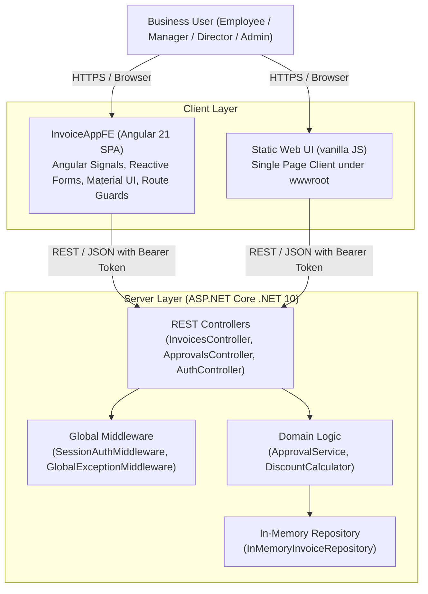

# C4 Container Diagram: Approval Limits by Role

```mermaid
graph TD
    User["Business User (Employee / Manager / Director / Admin)"]
    
    subgraph ClientLayer ["Client Layer"]
        SPA["InvoiceAppFE (Angular 21 SPA)<br/>Angular Signals, Reactive Forms, Material UI, Route Guards"]
        StaticUI["Static Web UI (vanilla JS)<br/>Single Page Client under wwwroot"]
    end
    
    subgraph ServerLayer ["Server Layer (ASP.NET Core .NET 10)"]
        API["REST Controllers<br/>(InvoicesController, ApprovalsController, AuthController)"]
        Middleware["Global Middleware<br/>(SessionAuthMiddleware, GlobalExceptionMiddleware)"]
        Domain["Domain Logic<br/>(ApprovalService, DiscountCalculator)"]
        Repo["In-Memory Repository<br/>(InMemoryInvoiceRepository)"]
    end

    User -->|"HTTPS / Browser"| SPA
    User -->|"HTTPS / Browser"| StaticUI
    SPA -->|"REST / JSON with Bearer Token"| API
    StaticUI -->|"REST / JSON with Bearer Token"| API
    API --> Middleware
    API --> Domain
    Domain --> Repo
```

